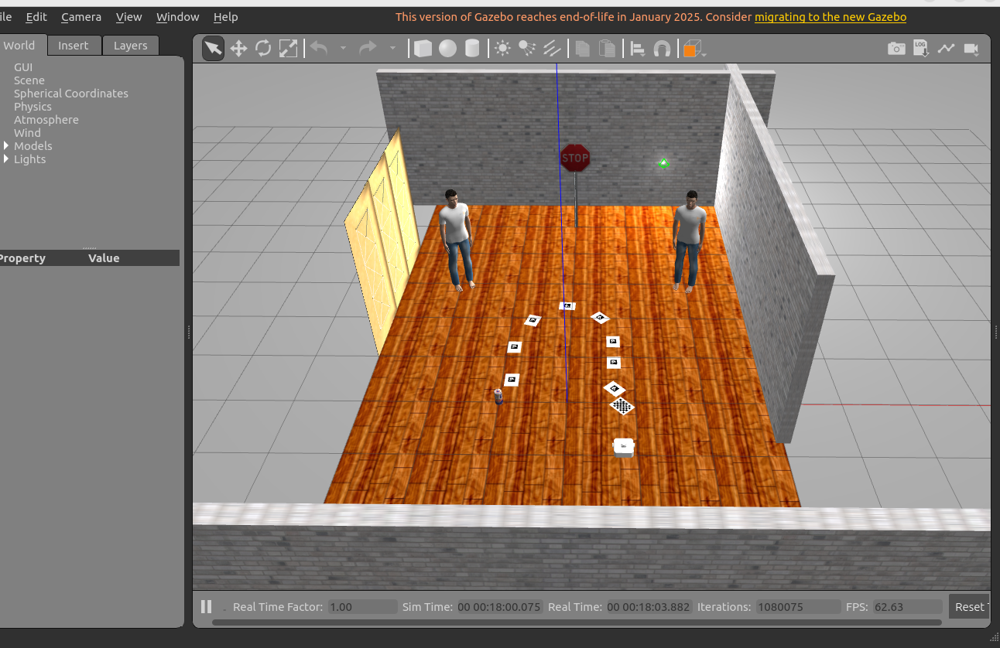
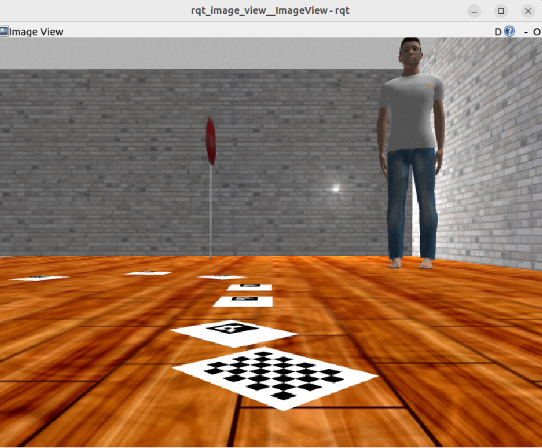

# ENPM673 Final Project: Vision-Based Intelligence for TurtleBot4

This project implements real-time visual perception and intelligent navigation on TurtleBot4 using only camera-based sensing. It combines ArUco marker-based navigation, projective geometry for horizon and vanishing point estimation, and optical flow-based obstacle detection.

[](https://youtu.be/jdZmPtGPZxo)


---

## Hardware Implementation on TurtleBot4

This package has been adapted for direct deployment on the TurtleBot4 hardware. Make sure the TurtleBot4 is connected to the ROS2 server and the modify the topic names in the ROS2 node script as per the need:

To run the main script:

```bash
source /opt/ros/humble/setup.bash
source install/setup.bash
ros2 run enpm673_final_proj enpm673_final_proj_main.py
```

---

## Gazebo Simulation Setup

If you want to test the system in Gazebo simulation (with the provided map and environment), follow these steps:

```bash
source /opt/ros/humble/setup.bash
colcon build --symlink-install --packages-select enpm673_final_proj
source install/setup.bash
ros2 launch enpm673_final_proj enpm673_world.launch.py "verbose:=true"
```

Gazebo world file:
- `enpm673_final_proj/worlds/enpm673.world`

**To view camera image:**  
```bash
ros2 run rqt_image_view rqt_image_view /camera/image_raw
```

**To manually drive TurtleBot4 in Gazebo:**  
```bash
ros2 run teleop_twist_keyboard teleop_twist_keyboard
```
Use `u i o`, `j k l`, and `m , .` keys to move around.

---

## Screenshots

  


---

## Troubleshooting

### Objects Have No Shadows in Gazebo
If using Gazebo 11.10 on Ubuntu 22.04, objects may lack shadows. Upgrading to Gazebo 11.14+ resolves this.


